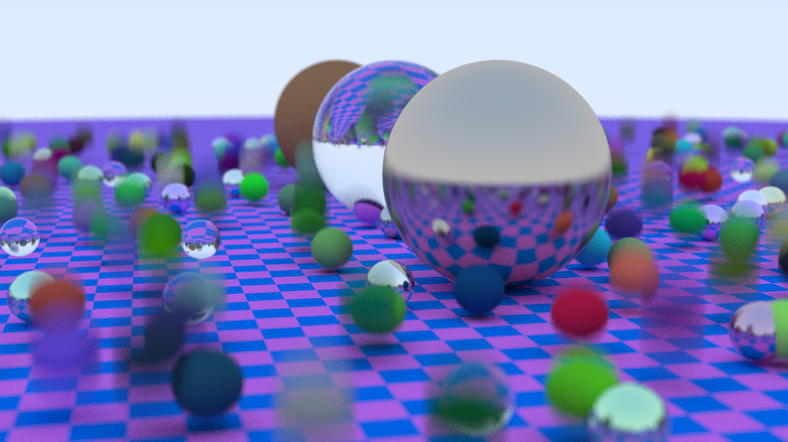

# RayTracing on GPU using OpenCL

> **NOTE** Although right now it is possible to generate a simple scene using this RayTracer, there are a lot of elements to be optimised and added, which haven't been added yet!!!
> So if you try to run this RayTracer on your computer, there is a big chance that you might have to configure this project manually.  

Simple RayTracer implemented on GPU using OpenCL API.

Using this RayTracer you can define simple scenes of spheres, where each of the spheres has its own material. You can find an example of such scene definition at the begining of file `./src/main.cpp`.

RayTracing algorithm in this project uses BVH tree as an optimisation method.

## How to run 

The project uses `Cmake` as a build tool, so the process of building is straightforward

```Bash
$ mkdir build
$ cd ./build
$ cmake ..
$ cmake --build .
$ cd ..
```

After build, in a project root directory you can find a binary file called `rt_gpu`. To generate an image just simply run 

```Bash
$ ./rt_gpu
```

If run is successful, in the root directory you will find an image file called `result.png`, which will look similar to this: 



## To Do 

- [ ] Change BVH tree structure on GPU for better performance 
- [ ] Add program call parameters
- [ ] Create better wrapper classes for OpenCL API
